时间：2018.05.13~2018.05.15

地点：广州 T.I.T创意园


## 零废弃联盟

### 简介

中国零废弃联盟（简称零盟），成立于2011年10月，由芜湖生态中心、自然之友、自然大学、宜居广州四家机构共同组成零盟秘书处（网络发展）。零盟旨在推动中国垃圾危机的解决，促进政府、企业、学者、公众及公益组织等社会各界在垃圾管理过程中的对话与合作。

零盟的定位：引领者，支持者，联结者

壹起分社区计划（进驻社区、开展垃圾分类的前后端）

- 壹起分——城市垃圾技能培训
- 壹起分——城市零废弃参访 


### 2018年零盟重要事件

1. 限塑令十周年发布会（5月31日）
2. 广州、成都、北京垃圾分类技能培训（5月、7月、11月）
3. 广州、成都、北京零废弃参访（5月、7月、11月）
4. 垃圾焚烧监管研讨会（6月）
5. 全国零废弃倡导日（7月17日）
6. 塑料大会（10月或11月）
7. 零废弃论坛+零盟年会（12月初）
8. 51个壹起分合作伙伴+6地壹起分推广交流会（7月开始...）
9. 北京、上海、深圳垃圾分类实施方案的调研


## 我与垃圾的七年之痒（巴索）

### 巴索的环保之路

2009年，广东番禺地区建设垃圾焚烧发电厂，当地的居民投入到反焚烧的维权活动中，引起了很大的社会反响，公权力的傲慢与居民的无助，更激发了当地居民站出来，为了维权而起来抗争。2010年番禺的垃圾焚烧发电厂项目暂停了，一位网名ID“巴索风云”的网友说，居民们从此看到了希望，看到了行动的力量，但垃圾围城问题仍然困扰这个城市。

巴索风云后来成为推动影响甚广的番禺反垃圾焚烧维权活动的核心人物之一，作为一名绿色公民，每周他和他们的“绿色家庭”志愿者都会在社区内进行垃圾分类活动，并努力推动广州市政府在有害垃圾、厨余垃圾等方面有所作为。

2012年6月，“宜居广州”在当地的民政局正式注册，巴索风云成为了这个组织的发起人和总干事。他带着“零废弃、绿公民、靓广州”的愿景，带领这个组织走上了倡导建立零废弃社区之路，成为连接政府、企业、社区的环保力量，建设公众参与的环保平台，实践与探索解决垃圾围城的可持续之道。

Nimby ？！邻避主义？

OR

解决问题？Solution ？！

案例：宜居广州 & 惜福环保 -> 承包广东翁源整个县的垃圾分类工作

对垃圾进行焚烧和填埋都是劣等方案，垃圾渗滤液中含有多种有毒有害的无机物和有机物。


### 影片《中途岛上的候鸟》

<iframe src="//player.bilibili.com/player.html?aid=16475092&bvid=BV1Dx411L75W&cid=26872729&page=1" scrolling="no" border="0" frameborder="no" framespacing="0" allowfullscreen="true"> </iframe>

把垃圾扔掉就可以了吗？

洋流把太平洋沿岸的垃圾裹挟到中途岛周边。在岛上筑巢的信天翁贴着波浪寻找食物的时候，常常把海面上的塑料垃圾当作鱼虾。这种翅展可达2米以上的大鸟，一次觅食要飞行几千公里，往返一次需要数天时间。为了填饱幼鸟，它们不知疲倦地在大海和巢穴之间飞行，却误把垃圾填进幼鸟的嘴和胃里，直到把幼鸟撑死。

巴索：“我的心里受不了，所以一定要解决这个问题。”


### 多方声音

- 键盘侠：垃圾分类很难做，中国人素质不行。
- 居民：我们分了没有，清洁工还不是混一起。
- 清洁工：你去看看垃圾桶，哪有多少居民在分类？其实就算我们分了，后面还是一锅端烧啊。
- 企业：没有分类，这些废料脏啊，再回收利用的价值不高，如果没有政策支持我们，难办！
- 相关部门：垃圾分类是好事，但很难做，能让居民往桶里扔垃圾就不错了，这需要时间的，现在还是先烧了解决问题。


### 顶层设计——政策

习近平：普遍推行垃圾分类制度

> “普遍推行垃圾分类制度，关系13亿多人生活环境改善，关系垃圾能不能减量化、资源化、无害化处理。要加快建立分类投放、分类收集、分类运输、分类处理的垃圾处理系统，形成以法治为基础、政府推动、全民参与、城乡统筹、因地制宜的垃圾分类制度，努力提高垃圾分类制度的覆盖范围。”

广州对低值可回收物处理实行补贴每吨90元

禁运24类洋垃圾


### 经验分享

- 环保局和城管委相互推卸；
- 灯泡、电池、药品不能放一起（电池会砸开灯泡）；
- 广州市生态循环园（环保教育）；
- 厨余垃圾占比超过一半，厨余垃圾是关键；
- 黑水虻处理厨余；
- 做好垃圾量及成分调查，分析产生的原因，因地制宜。

**信守一生，终达彼岸**

我们可能成功，我们可能失败，但我们从未放弃——大自然不需要人类！


### 影片《一场围绕垃圾的战争》

前端做好分类

不叫作垃圾，而是资源

一边爬山一边做环保，一边划独木舟一边做环保

资源回收处，每一类资源都有固定日期回收

慈济志工：今天如果让我像以前一样，把所有东西放在一起，我会有罪恶感。


## 垃圾问题的现状（田倩）

### 城市垃圾处理链条

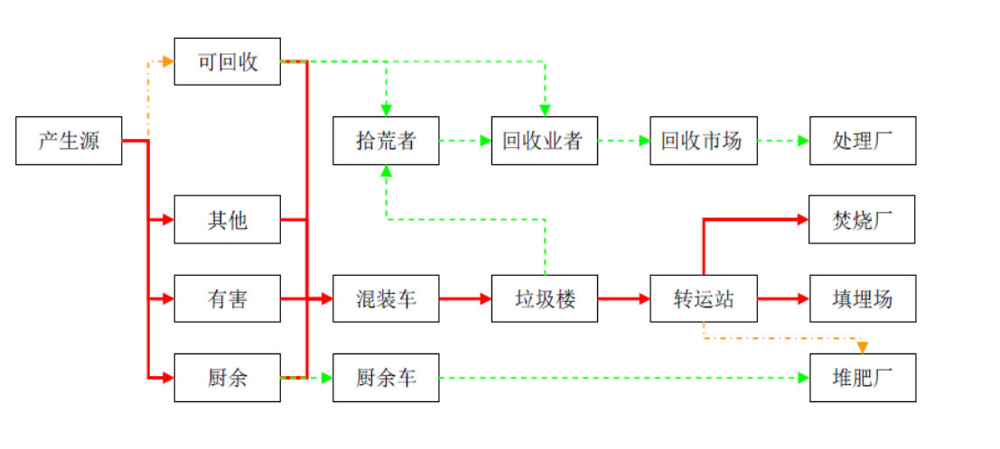

**垃圾分类是一个系统性工程，互联网或者智能箱只能说在分类收集上的创新**，但是成效呢？

- 2020：全国餐厨垃圾处理的能力：3.44万吨/日
- 2020：北京餐厨垃圾处理的能力：0.15万吨/日
- 2020：广东餐厨垃圾处理的能力：0.34万吨/日

- 2015：全国餐厨垃圾处理的能力：3.02万吨/日
- 2015：北京餐厨垃圾处理的能力：0.21万吨/日
- 2015：广东餐厨垃圾处理的能力：0.40万吨/日

规划和运行状况，厨余垃圾末端处理能力，非常缺乏！　　

我国垃圾产生量大，没有有效的控制，长时间的末端处理思维，填埋、焚烧为最重要的技术路线，厨余垃圾生化处理严重设施滞后、可回收处理行业萎缩，有害垃圾是盲区，分类没有实质性进展。

现状：

- 量多增幅大
- 只重视末端处理（焚烧、填埋） 


### 欧盟的固废处理塔状结构原则

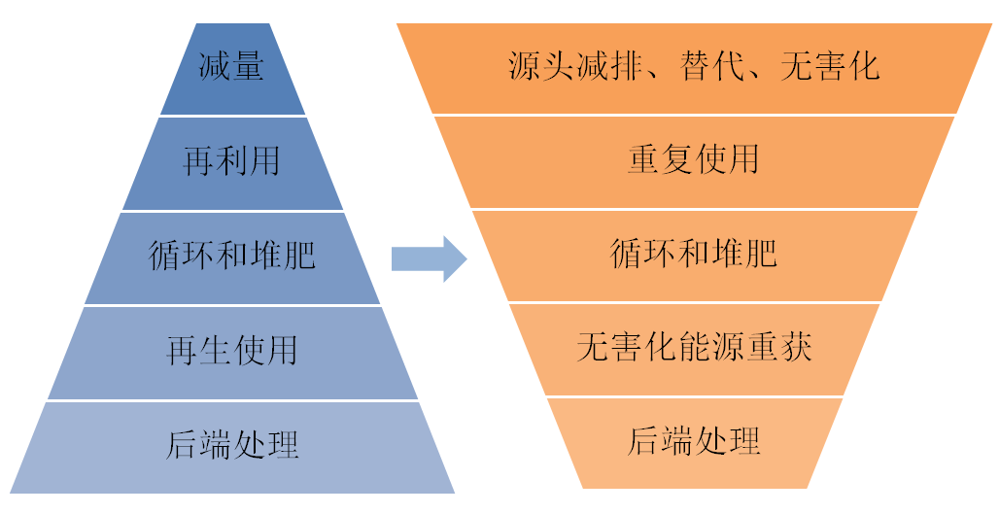

（左）不利于循环经济的垃圾管理序列

（右）有利于循环经济的垃圾管理序列

- 最好的环境控制效果，完整的资源生命周期；
- 按照优先级别控制；
- 最大限度防止垃圾的产生；
- 为废物找到再用、循环、再生的途径和方法；
- 后端处理是最后的方法！


### 垃圾管理目标的优先顺序

1. 旨在避免垃圾形成和降低其后续有害性的产品设计和生产过程设计
2. 产品或部件的再利用
3. 废弃物分类和无害化的再生资源回收利用
4. 无害化的能源重获
5. 最终的无害化处置


### 面对我国垃圾问题的解决方案

1. 垃圾分类必须成为重要的国策和技术路线
2. 垃圾分类的顶层设计和制度保障（全国+地方）
3. 前端减量，尤其是一次性用品的控制必须突破
4. 垃圾分类的示范区


### 台湾垃圾四合一制度计划（1997年）

（一）社区民众

1. 鼓励小区组织推动回收
2. 推广家户垃圾分类

（二）回收再生厂

1. 鼓励民间企业发展
2. 向民众、小区及清洁队收购资源物质

（三）地方政府

1. 将资源垃圾与一般垃圾分开收集清运
2. 回馈奖励制度鼓励民众小区参与回收

（四）回收基金

1. 由责任业者缴费，以补贴回收处理系统


### 台湾垃圾分类、资源回收、垃圾清运

台北市于1996年3月起推行 [垃圾不落地] 政策，由里而区，全面推行。1997年4月全台北市实施结合 [垃圾分类]、[资源回收]、[垃圾清运] 三项工作于同一时间完成，称之为 “**三合一资源回收计划**”，这项计划使资源回收量快速成长两倍。

打造垃圾分类的示范区非常重要的是：证明可行、提供解决方案、更大规模复制、倒推政策。


### 走向分类！

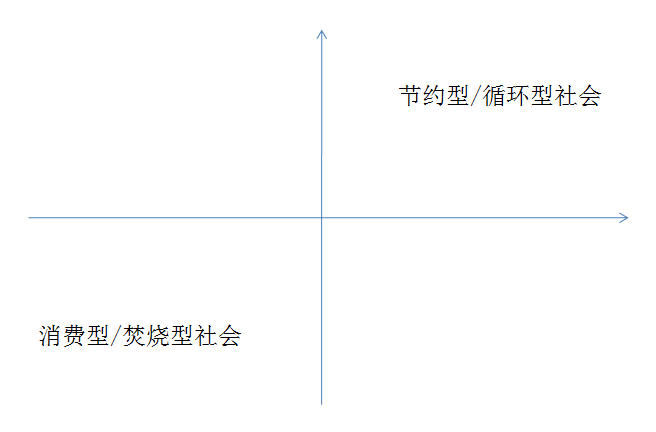


## 垃圾分类与社区治理（郝利琼）

### 社区垃圾分类工作

思考：你们在社区/学校/单位里做过哪些和垃圾分类有关的活动？

讨论：为什么会选择做这些活动？这些活动取得了什么效果？

这些活动可以分成哪些类别？为什么这样分？


### 组织定位


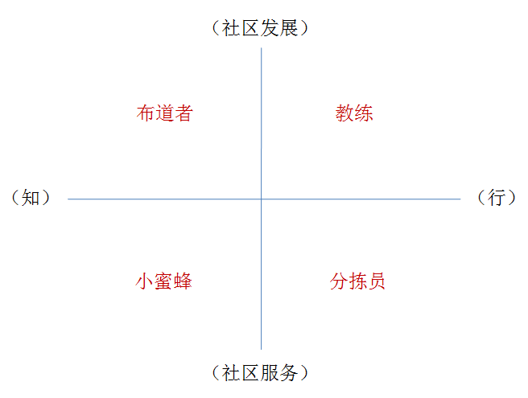


### 思考与讨论

阅读正旺小区的案例，讨论：

- 十几年里，正旺小区在垃圾分类上做了哪些工作？通过这些活动取得了什么成果？
- 你认为，正旺小区的垃圾分类工作成功吗？为什么？


正旺小区的垃圾分类工作是**不成功**的，因为：

- 居民没有从意识到行为的改变（或这种改变是不稳定的）
- 没有建立稳定的社会或社区系统来支持居民行为的改变

**背后原因：垃圾分类是外来的，不是内生的**


社区垃圾分类成功的关键

- 外来的任务 —> 社区/居民自身的职责
- 外来的要求 —> 社区自身的动力
- 外来的服务 —> 内在的系统


如何实现成功的社区垃圾分类？

- 建立可持续的社区
- 垃圾分类管理系统

（一个垃圾桶的干净程度直接影响垃圾分类的可持续性）


### 垃圾分类与社区治理的关系

```
| 垃圾 |  ----（促进）--->  | 社区 |
| 分类 |  <---（保证）----  | 治理 |
```

垃圾分类是一个社区工作，垃圾分类不能单靠政府，需要基层民众的参与。


### 社区垃圾分类的工作目标

如何实现成功的社区垃圾分类？—— **建立可持续的社区垃圾分类管理系统**

社区系统包括：

- 管理
- 硬件
- 组织

```
社区系统 <--> 社会系统 
```


### 社区垃圾分类的定义

做了这么多事儿，让我们来重新思考下：什么是社区垃圾分类？

> “社区居民持续地对其产生的垃圾进行准确的分类投放，以减少垃圾对人类环境和健康的影响的行为。这些行为的可持续，需要以全社会的共识为基础，并获得政府和社区的有力支持。”

垃圾分类，是一种生活方式。

综合社会改革，垃圾分类是一场革命。

关键：如何打造一个可自运营的模式

不要孤立地做社区垃圾分类，这样很可能会失败的！

垃圾分类是：

- 一个典型的社区工作
- 一个改变人行为习惯的工作
- 一个社区的变革工作（原来只管生产，不管回收，要有系统思维）


### 案例

- 昌林公寓垃圾分类（2013-2018）
- 上海市静安区临汾路街道景凤路52弄（李磊）

关键：搞好与上级领导的关系，组建中老年志愿者团队


#### 分类前的工作

1. 发放征询表；
2. 居民投放习惯调研；
3. 洗手处、湿垃圾桶、其他垃圾桶位置的设计；
4. 因投放除袋产生的时间对居民情绪的影响；
5. 志愿者文明语言的培训。


####  建立示范指导员值班制度

志愿者值班扫描积分和保洁员每一小时的巡视二次分拣。

团队建设：

- 组件志愿者队伍；
- 内部团结的重要性；
- 精神为主的激励机制；
- 关爱志愿者的值班积分扫描制度。


#### 激励机制很重要

- 新闻媒体的报道、上级领导的肯定、居民群众的赞扬；
- NGO的引导、培训和推荐表扬；
- 适当的物质奖励（绿色账户激励机制）；
- 组织志愿者学习、观摩活动；


**“26秒可以完成的事情不要等一辈子”**


## 社区垃圾分类的组织系统（罗丹）


### 推动生活垃圾可持续管理

- 立足社区
- 生态社区建设
- 公众教育
- 政策倡导与推动


### 组织系统的特点

- 组织性
- 志愿性
- 非营利性
- 民间性
- 非政治性
- 自治性


### 组织系统需要具备的“三个力”

- 影响力：能够调动资源；能够决策资金、硬件等；居民足够信任。
- 行动力：能投入足够的时间精力；对社区情况足够熟悉，推进工作快速有效。
- 专业力：理解认同社区垃圾分类工作；掌握工作中所需的知识和方法。


### 如何形成有这三个力的组织系统

三驾马车：居委会、业委会、物业


### 组织系统的四个来源方向

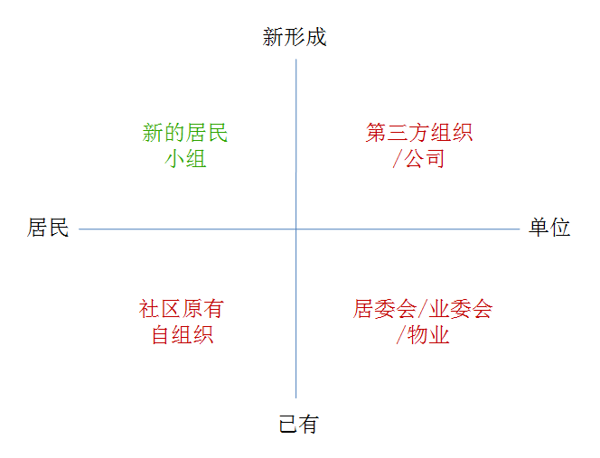


搭建组织系统的模拟练习

6个角色：柠檬社区服务中心、居委会主任、物业经理、业委会主席、舞蹈队队长、核心志愿者

柠檬组访谈其他五个组，具体任务要求见任务书，每个组的任务书不要给别人看到。


|            | 资源/支持                              |
| :--------- | :------------------------------------- |
| 居委会     | 居民动员、核心志愿者、宣传渠道、资金等 |
| 物业公司   | 硬件添置、管理、资金，协调保洁员       |
| 业委会     | 资金、与居民沟通、影响物业             |
| 社区自组织 | 居民动员渠道、影响业委会和居委会       |
| 志愿者     | 参与行动、想居民宣传                   |


### 案例

- 上海河滨豪园
- 物管大哥变堆肥讲师
- 以种菜的名义做垃圾分类 


## 垃圾分类的硬件调整与管理（郝利琼）


### 还原一个社区垃圾投放的现状

请标记：

- 住户楼分布（注明多层、高层）
- 社区出入口
- 主干道
- 现有居民投放垃圾的地点（外观、容器）
- 简述社区基本情况（户数、层高）

没有分类的小区，硬件的特点是什么？—— 桶多点散，桶脏


### 上海社区对垃圾分类硬件的基本要求

1. 每个厢房配备干湿分类桶，至少一个在用厢房
2. 每个厢房及投放点皆须有内容完整、清晰地分类标识
3. 厢房和投放点皆需

讨论一下，正旺小区的硬件需要做哪些调整？

参考原则：

- 固定投放点（出入口、主干道）
- 兼顾到更多楼栋
- 高楼撤桶
- 每200~300户一个点位（每个点都需要志愿者值班？一个点位有多大？四分类垃圾厢房？）

**桶越少越利于管理，成本低，美化**


### 垃圾分类硬件设置的基本原则

- 相对集中
- 合适的容器
- 标识清晰
- 具备工具（照明、洗手池等）


### 硬件系统管理与维护的要点

- 分类桶摆放正确
- 标识清晰无破损
- 清洁工具摆放有序
- 干净无异味


### 案例

广盛公寓 


## 如何动员社区里的人（罗丹）

- Part1. 社区调研
- Part2. 宣传教育
- Part3. 居民小组活动
- Part4. 启动大会
- Part5. 打造家庭垃圾分类


### 社区调研

调研的目的是什么？

- 告知社区要开始垃圾分类
- 了解居民的基本的态度，挖掘志愿者
- 宣传垃圾分类的基本知识


#### 社区居民调研练习

背景：柠檬社区发展中心经过跟居委会的大量沟通，终于决定在正旺小区开展垃圾分类

任务：

1. 每人抽取一张角色卡，按照上面的身份提示，自行演绎
2. 除柠檬的工作人员外，其他人不要公开自己的身份
3. 柠檬的工作人员需要与所有人分别沟通访谈，实现调研的三个目的，并去识别，现场有哪些角色
4. 准备10分钟，访谈20分钟

角色：

- 红袖章
- 面具人
- 冷面侠
- 反思者
- 随大流
- 挖苦怪


#### 社区里的神秘力量

|  角色  | 类型                               | 策略                                             | 注意                                               |
| :----: | ---------------------------------- | ------------------------------------------------ | -------------------------------------------------- |
| 红袖章 | 党员积极分子、核心志愿者、楼组长等 | 政策（新闻联播、城市规划等）引导，通过居委会介绍 | 邻里关系未必良好，反馈未必真实                     |
| 面具人 | 社区自组织成员（活跃分子）         | 尽可能的增加接触，了解真实需求后切入             | 分辨表达的真伪（口头认同不代表行为支持）           |
| 冷面侠 | 知识分子、年轻人、出租户           | 先放放吧                                         | 先放放吧                                           |
| 反思者 | 党员积极分子、核心志愿者、楼组长等 | 多问他们意见，坚持行动让他们看到                 | 不要让他们表达出来的负面情绪打击了工作的积极性     |
| 随大流 | 社区里的绝大部分人                 | 在社区加大垃圾分类的成绩宣传，塑造浓厚宣传氛围   | 这部分人占比很大，需要提前了解他们的态度和参与障碍 |
| 挖苦怪 | 社区里的刺头、愤青等               | 给他们一些责任和荣誉，让他们多多站到台前来       | 可能他们与社区有其他历史恩怨，要提前了解清楚       |


#### 垃圾分类志愿者的职责

- 社区宣传
- 数据收集
- 以身作则
- 定点值守


#### 志愿者的管理与激励

- 制度
- 负责人
- 精神激励
- 物质激励


#### 案例

一个人开始的和馨苑


### 宣传教育

宣传教育 ≠ 做活动


#### 宣传教育的目的

1. 意识提升
2. 知识技能掌握
3. 行为的改变
4. 影响和带动

活动需要有长期性、专业性、有特色、适用性。

警惕：

- 为了做活动而做活动
- 工作无主线，活动之间不关联
- 活动难以持续
- 难以招募参与者

注意：活动只是载体，要符合实际，以居民成员为主导，共同商定，并能升级延伸。

重点：

- 围绕垃圾可持续管理的主题
- 它是系统性的工作
- 与生活相关、趣味性
- 了解目标对象特点，循序渐进


### 居民小组活动

讨论、学习形成常态（可以邀请公益机构、专业人士）

利用手艺将旧衣物改造成收纳袋

我们是协作者，怎么样把居民的积极性调动起来？

**我们是不会再这个小区长期待下去的！**怎么样把居民调动起来？


### 启动大会

启动大会的重点：

- 有效的传播：工作、机构
- 可以进行社区调查
- 借此搭建与居民的关系

注意：

- 难以找到足够的社区居民
- 如涉及到发奖品，现场可能会难以控制
- 不浪费物资的情况下，如何有现场感


### 打造家庭垃圾分类

#### 步骤

首先要知道：

- 看不见，不等于不存在
- 我的垃圾，我负责

其次要知道：

- 固废处理的优先顺序（倒三角模型）

还要知道：

- 3R（Reduce、Reuse、Recycle）

最后可实践：

- 零废弃生活 | 极简主义

“能卖拿去卖，有害挑出来，干湿要分开”

#### 案例

- 一年只有一瓶垃圾，一家四口零废弃极简生活主义
- 小区共享菜篮子

#### 注意

1. 家庭行动的可持续性
2. 现有的末端清运的状态会影响执行效果
3. 家庭行动的跟进、关系维护的时间消耗大


### NGO工作的价值观

- **来社区的目的是为了离开社区**
- 不是活动，致力于打造可持续的社区垃圾管理体系
- 长期、自主实现垃圾分类成功
- 垃圾分类不仅是垃圾分类，而是公民教育，社区建设


## 社区里的可回收物、有害垃圾处置（田倩）

### 社区可回收物的几个关键点

- 考虑清楚在社区开展可回收物的目标是什么
- 寻找可靠的回收公司（环境友好）、回收更多品类的公司是关键
- 确定回收渠道和品类，开展相应可回收物的收集
- 寻找可回收物，尤其是低价值回收物存储额空间
- 公众教育


**第一步：想清楚机构为什么要开展可回收物的收集？和机构社区垃圾分类的目标有什么关系？**

1. 我和周边的回收商公众有什么区别？
2. 我的独特价值在哪？
3. 我撤出之后，如何维持？


**第二步：调研小区现有的可回收物渠道和条件**

1. 现有小区是否已经有回收的渠道？
2. 谁来做？居民自己卖，还是物业公司、保洁人员？
3. 我的参与，是否会打破小区原有回收格局，如何融合？
4. 小区是否有可回收物的存储空间？
5. 观察社区垃圾桶可回收物的种类


**第三步：寻找和确定回收渠道**

1. 走访社区周边的回收站
2. 回收流动者
3. 再生资源行业协会
4. 供销社体系
5. 互联网+回收商

要了解回收的种类、吨数、地域活动范围等。


---

收集后端处理信息：[R立方](https://mp.weixin.qq.com/s/lRvCOv7wjMLXzRtiPKr5iw)


重点解决低价值可回收的问题，场地支持是关键

低价值是难点，如何解决？！

利乐包：纸铝塑复合包装

宜居广州：[废旧电池如何处理](https://mp.weixin.qq.com/s/0lIPS5knwuDfYVIMW5Ub_A)


打通渠道，需要我们做尝试

广州的过期药品交给街道办

[广药白云山家庭过期药品回收](https://mp.weixin.qq.com/s/U3k8Gy17gISCs4sj7IyyNA)


## 厨余垃圾分类与处理（巴索）

### 什么是厨余垃圾

厨余垃圾应该包括生厨余（瓜果皮）、熟厨余（剩饭剩菜）以及园艺、农业废弃物，甚至包括动物粪便等等。

### 环保酵素

一般只能处理生厨余

按质量比：1份红糖，3份厨余，10份水

### 好氧堆肥

利用与空气接触较好的容器，如网箱、木箱、通气式种植箱等，进行有氧发酵。气味较轻，但时间长。

### 波卡西堆肥

波卡西堆肥法是日本琉球大学比嘉照夫教授研究开发的，“波卡西”是从一个日语单词 BOKASHI 而来，意思是“发酵有机物”。波卡西堆肥是指将 EM 活菌制剂混合到被发酵物里，一同存放进密封的发酵容器，通过间缺性缺氧发酵来分解被发酵物质的一种堆肥方法。

EM 是 Effective Microorganisms 的缩写，意思是“有效微生物”。它是由光合菌、放线菌等功能各异的80多种微生物组成的一种活菌制剂。这些微生物组合在一个统一体中，互相促进，共同构成一个复杂而稳定的具有多元功能的微生态系统，可以抑制有害微生物，尤其是病原菌和腐败细菌的活动，促进植物生长。

采用带有出水龙头的密封厨余桶，引入EM菌，进行间歇性无氧发酵。

成功的话是无气味或气味较轻的（轻微的酒曲味或醋味），时间较短，定期取出波卡西液，稀释使用。

关键点：控制厨余大小，每添加10厘米左右厚的一层厨余，就撒上一层EM菌，最好能覆盖75%以上的厨余表面积。

### 蚯蚓堆肥

利用蚯蚓养殖箱构成一个生态系统，蚯蚓吃掉有机质后排出蚯蚓粪。

气味较轻，时间短。

使用“太平二号”蚯蚓

控制好PH值（弱酸性）

### 黑水虻堆肥

建议堆肥箱至少0.75立方 


## 知识拼图


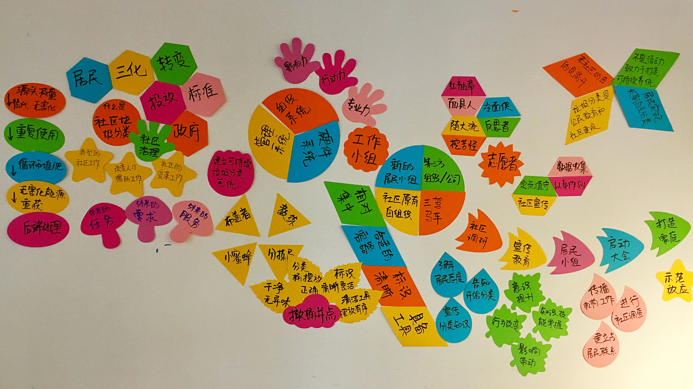


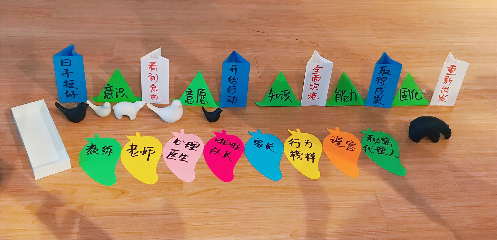


## 导师通讯录

宜居广州生态环境保护中心

- 巴索风云

零废弃联盟

- 田倩

上海爱芬环保

- 郝利琼

成都根与芽

- 罗丹


---

## 活动留影


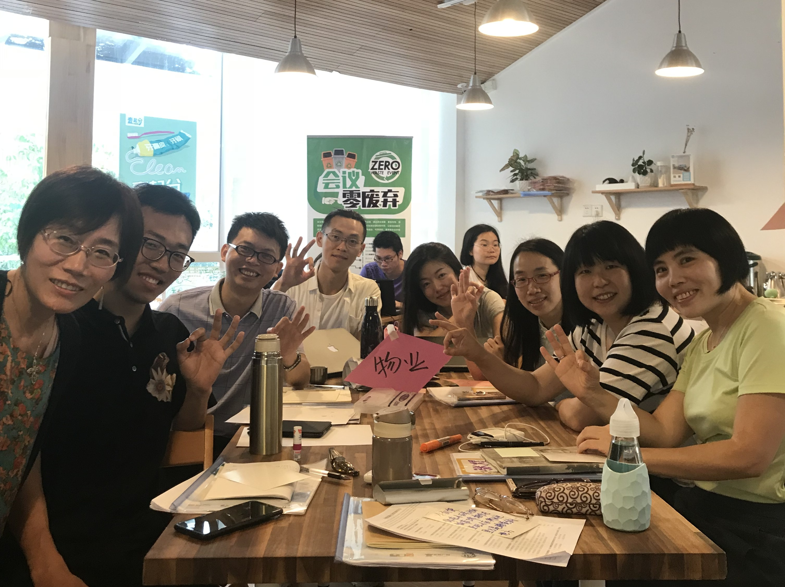


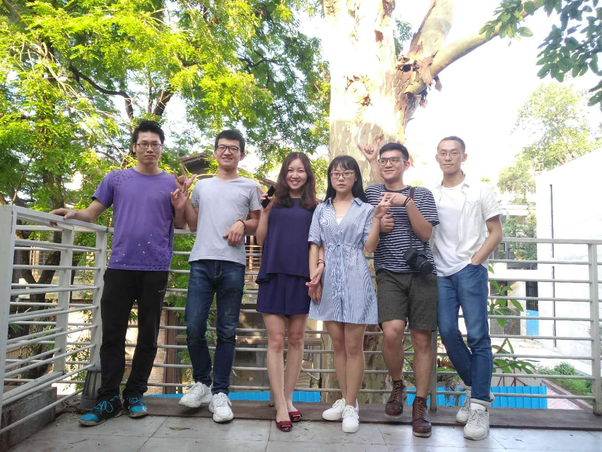


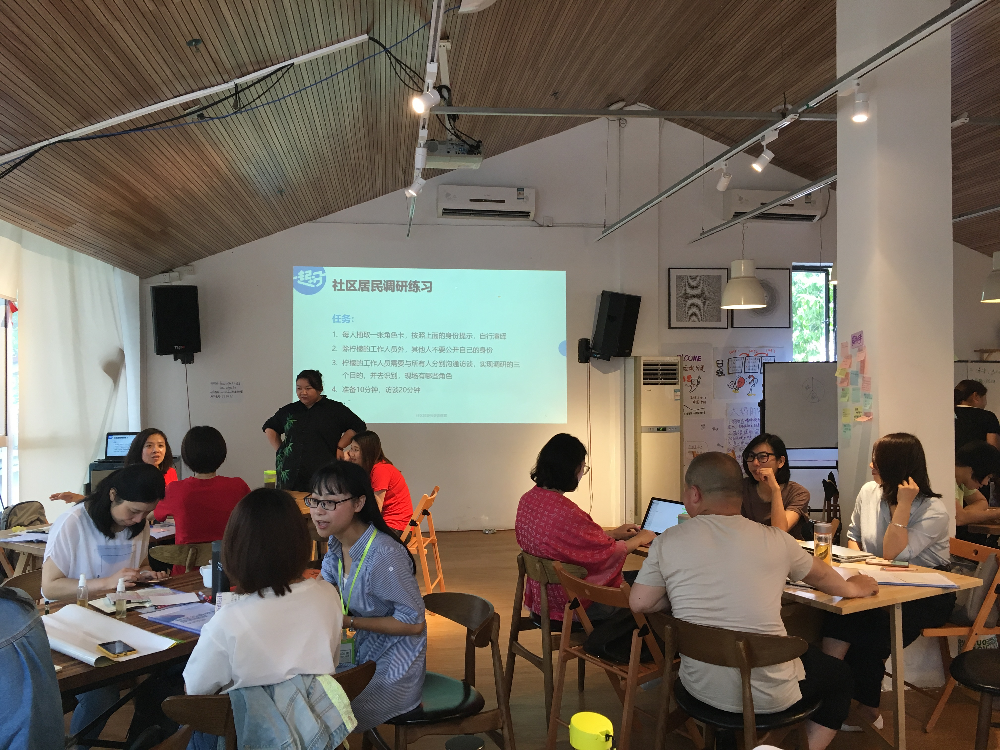


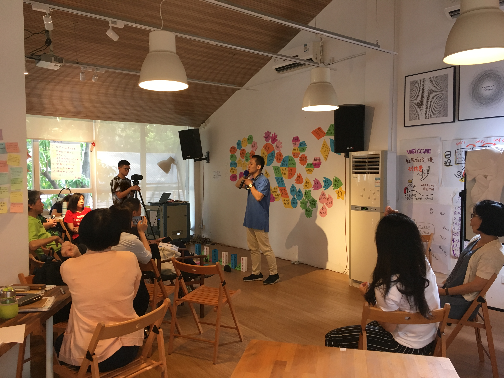


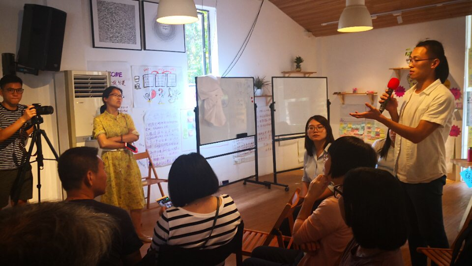


## 人员名单

工作人员：郝利琼、罗丹、李春华、巴索风云、田倩、李本本

学员名单：

| 序号 |  姓名  |                 机构                 |
| :--: | :----: | :----------------------------------: |
|  1   |  傅琦  |     哈尔滨市友爱社会工作服务中心     |
|  2   |  朱榕  |         福建省环保志愿者协会         |
|  3   | 谢晓慧 |            万科公益基金会            |
|  4   | 柏亚军 |           东莞市南城供销社           |
|  5   | 翟满堂 |           东莞市南城供销社           |
|  6   | 李东晖 |      长沙市绿动社区环保服务中心      |
|  7   | 吴亚莎 |      长沙市绿动社区环保服务中心      |
|  8   |  李婷  |     山西省晋城市社会工作服务中心     |
|  9   |  张群  |        大同市再生资源行业协会        |
|  10  | 李婉雪 |   南京市雨花台区百蝶缘生态发展中心   |
|  11  | 朱惠萍 |        金华市麦地社区服务中心        |
|  12  | 刘群娣 |      中山市邻舍社会工作服务中心      |
|  13  | 刘潇婷 |         好猫生态文明推广中心         |
|  14  |  任彤  |         中国矿业大学（北京）         |
|  15  |  谭爽  |    中国矿业大学（北京）行政管理系    |
|  16  |  刘彤  |     深圳市南山区万家福居家养老社     |
|  17  | 林心怡 |       深圳市龙华区零废弃促进会       |
|  18  | 李丽媛 |       长沙源方环保公益发展中心       |
|  19  | 郭亚芬 | 身心健康（广州）户外活动策划有限公司 |
|  20  | 陈永军 |     山西省晋城市社会工作服务中心     |
|  21  | 谭瑶春 |       长沙源方环保公益发展中心       |
|  22  |  吴勇  |              鹿城环保社              |
|  23  | 陈威涛 |  金华市金东区馨家园社会工作服务中心  |
|  24  | 袁英杰 |     哈尔滨市友爱社会工作服务中心     |
|  25  | 曹忠双 |   易代收信息技术（连云港）有限公司   |
|  26  | 郭红叶 |  天津市生态城绿色之友生态文化促进会  |
|  27  | 麦洁莹 |       广州市绿点公益环保促进会       |
|  28  |  陈静  |       广州市绿点公益环保促进会       |
|  29  | 邓宇虹 | 广州市天河区绿色城乡生态社区发展中心 |
|  30  | 卢华东 | 广州市天河区绿色城乡生态社区发展中心 |
|  31  | 邓丽华 |       广东惜福环保科技有限公司       |
|  32  | 邓玉红 |       广东惜福环保科技有限公司       |
|  33  | 钟丽慧 |       广东惜福环保科技有限公司       |

