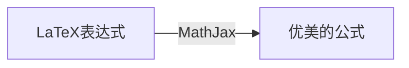

在前面《[了解常用 Markdown 扩展语法](https://luhuadong.blog.csdn.net/article/details/114498117)》简单介绍了如何在 Markdown 中插入数学公式，关于这个话题还是蛮有趣的。尤其在专业领域，常常需要引入公式进行论证，如何呈现印刷级别的公式就很重要啦！好在 Markdown 扩展语法支持 LaTeX 公式表达，并且有像 MathJax 这样优秀的工具渲染 LaTeX 数学表达式。


MathJax 是一个跨浏览器的 JavaScript 库，它使用 MathML、LaTeX 和 ASCIIMathML 标记在 Web 浏览器中显示数学符号。MathJax项目始于2009年，是早期 JavaScript 数学格式化库 jsMath 的继承者，由美国数学学会管理。MathJax 是在 Apache 许可证下发布的开源软件，GitHub 地址是 <https://github.com/mathjax/MathJax> 。

LaTeX 则是一个对数学公式进行排版的系统。他们的关系如下：



额，这一节其实跟 Markdown 没太大关系 :joy:

唯一要记住的就是行内标记使用一个 `$` 包裹，行间标记使用两个 `$$` 包裹 LaTeX 表达式。


## LaTeX 基本用法


## 字体

### 字体命令

字体命令用于定义字体，在 LaTeX 中用的字体有：

- 罗马字体（`\rm`）
- 黑体（`\bf`）
- 意大利体（`\it`）
- 小号大写字体（`\sc`）
- 斜体（`\sl`）
- 打字机字体（`\tt`）
- 强调字体（`\em`）

其中强调型字体不是一种新的字体，而仍是上述六种之一。LaTeX 规定：如果当前字体为罗马字体，则强调型为意大利字体；如果当前字体为非罗马字体，则强调型字体为罗马字体。

例如：

```latex
{\it 这是意大利体}
```

$$
{\it 这是意大利体}
$$

### 字号命令

字号命令用于定义字符的大小。字号命令有：

- `\tiny`
- `\scriptsize`
- `\footnotesize`
- `\small`
- `\normalsize`
- `\large`
- `\Large`
- `\LARGE`
- `\huge`
- `\Huge`

字号命令的引用格式为：`{命令 内容}`。


## 数学表达式

### 分数

```latex
{\frac{a}{b}}
```

$$
{\frac{a}{b}}
$$


### 导数


### 极限


### 求和


### 微积分


### 矩阵


## 化学方程式


### 在等号上下写字

**在等号上面写字**

```latex
\overset{\text{def}}{=}
```

效果：
$$
\overset{\text{def}}{=}
$$


**在等号下面写字**

```latex
\underset{\text{heated}}{=}
```

效果：
$$
\underset{\text{heated}}{=}
$$
我们发现这种方式显示的等号太短了，在输入化学方程式的时候，如果需要添加较多的附加条件就显得不协调。比如：
$$
\overset{\text{稀硫酸、}140^\circ{\rm C}}{=}
$$
这时候需要使用下面介绍的长等号。


### 使用长等号

```latex
\xlongequal[140^\circ{\rm C}]{\text{稀硫酸}}
```


$$
\xlongequal[140^\circ{\rm C}]{\text{稀硫酸}}
$$

`\xlongequal` 的用法是：

```latex
\xlongequal[下面]{上面}
```


例如：

```latex
\text{左} \xlongequal[\text{上}]{\text{下}} \text{右}
```

$$
\text{左} \xlongequal[\text{上}]{\text{下}} \text{右}
$$


### 示例

```latex
{2\rm{C_2H_5OH}}{\overset{\text{稀硫酸、}140^\circ{\rm C}}{=}}{\rm C_2H_5OC_2H_5+H_2O}
```

$$
{2\rm{C_2H_5OH}}{\overset{\text{稀硫酸、}140^\circ{\rm C}}{=}}{\rm C_2H_5OC_2H_5+H_2O}
$$

```latex
{2\rm{C_2H_5OH}}\xlongequal[140^\circ {\rm C}]{\text{稀硫酸}}{\rm C_2H_5OC_2H_5+H_2O}
```

$$
{2\rm{C_2H_5OH}}\xlongequal[140^\circ {\rm C}]{\text{稀硫酸}}{\rm C_2H_5OC_2H_5+H_2O}
$$


## LaTeX 符号

### 特殊字符

|  名称   |    大写    |     写法     |    小写    |     写法     |
| :-----: | :--------: | :----------: | :--------: | :----------: |
|  alpha  |  $\Alpha$  |  `$\Alpha$`  |  $\alpha$  |  `$\alpha$`  |
|  beta   |  $\Beta$   |  `$\Beta$`   |  $\beta$   |  `$\beta$`   |
|  gamma  |  $\Gamma$  |  `$\Gamma$`  |  $\gamma$  |  `$\gamma$`  |
|  delta  |  $\Delta$  |  `$\Delta$`  |  $\delta$  |  `$\delta$`  |
| epsilon | $\Epsilon$ | `$\Epsilon$` | $\epsilon$ | `$\epsilon$` |
|  zeta   |  $\Zeta$   |  `$\Zeta$`   |  $\zeta$   |  `$\zeta$`   |
|   eta   |   $\Eta$   |   `$\Eta$`   |   $\eta$   |   `$\eta$`   |
|  theta  |  $\Theta$  |  `$\Theta$`  |  $\theta$  |  `$\theta$`  |
|  iota   |  $\Iota$   |  `$\Iota$`   |  $\iota$   |  `$\iota$`   |
|  kappa  |  $\Kappa$  |  `$\Kappa$`  |  $\kappa$  |  `$\kappa$`  |
| lambda  | $\Lambda$  | `$\Lambda$`  | $\lambda$  | `$\lambda$`  |
|   mu    |   $\Mu$    |   `$\Mu$`    |   $\mu$    |   `$\mu$`    |
|   nu    |   $\Nu$    |   `$\Nu$`    |   $\nu$    |   `$\nu$`    |
|   xi    |   $\Xi$    |   `$\Xi$`    |   $\xi$    |   `$\xi$`    |
| omicron | $\Omicron$ | `$\Omicron$` | $\omicron$ | `$\omicron$` |
|   pi    |   $\Pi$    |   `$\Pi$`    |   $\pi$    |   `$\pi$`    |
|   rho   |   $\Rho$   |   `$\Rho$`   |   $\rho$   |   `$\rho$`   |
|  sigma  |  $\Sigma$  |  `$\Sigma$`  |  $\sigma$  |  `$\sigma$`  |
|   tau   |   $\Tau$   |   `$\Tau$`   |   $\tau$   |   `$\tau$`   |
| upsilon | $\Upsilon$ | `$\Upsilon$` | $\upsilon$ | `$\upsilon$` |
|   phi   |   $\Phi$   |   `$\Phi$`   |   $\phi$   |   `$\phi$`   |
|   chi   |   $\Chi$   |   `$\Chi$`   |   $\chi$   |   `$\chi$`   |
|   psi   |   $\Psi$   |   `$\Psi$`   |   $\psi$   |   `$\psi$`   |
|  omega  |  $\Omega$  |  `$\Omega$`  |  $\omega$  |  `$\omega$`  |


### 求和、积分

| 符号 |  写法  |      示例       |   Markdown 代码   |
| :--: | :----: | :-------------: | :---------------: |
| 求和 | `\sum` |   $\sum_1^n$    |   `$\sum_1^n$`    |
| 积分 | `\int` | $\int_1^\infty$ | `$\int_1^\infty$` |


### 分式、根式

| 符号 |  写法   |       示例       |   Markdown 代码    |
| :--: | :-----: | :--------------: | :----------------: |
| 分式 | `\frac` |  $\frac{1}{n}$   |  `$\frac{1}{n}$`   |
| 根式 | `\sqrt` | $\sqrt[3]{1000}$ | `$\sqrt[3]{1000}$` |


**LaTex 公式对照表**

<https://en.wikibooks.org/wiki/LaTeX/Mathematics>


## 参考

- https://en.wikibooks.org/wiki/LaTeX/Mathematics
- [一份其实很短的 LaTeX 入门文档](https://liam.page/2014/09/08/latex-introduction/)
- [超详细 LaTex数学公式](https://blog.csdn.net/ViatorSun/article/details/82826664)

