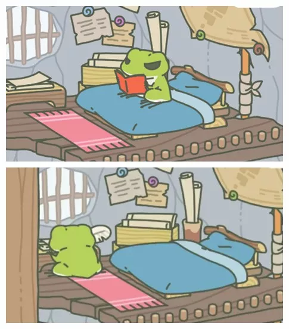

文章首发于微信公众号「[环保R先生](http://mp.weixin.qq.com/s?__biz=MzAxNjcyNDU1OQ==&mid=2649507319&idx=1&sn=b626098b7d23b4dfb1dffe65ab677680&chksm=83e882d7b49f0bc14b50f13f0e6c9a6ab204dec491eff783beae8bb5bcfe7804947a02987dbc#rd)」

---

最近一款名为《旅行青蛙》（旅かえる）的日本手游走红中国，连刀塔、农药都没玩过的R先生也走上了养蛙的道路。吸引R先生的，除了那只追求诗和远方的蛙，还有每个场景里所讲述的环保故事，这简直是一只热爱生活、热爱自然、热爱和平的零废弃好蛙！

What？你不相信它是只环保的蛙？跟着R先生的步伐看一下吧~

## 零垃圾生活

自带小花园独栋双层 Loft 全景图

趁蛙儿在家吃饭，我们采访一下它。看看它是怎么做到零垃圾生活的~

采用原始的草木石装修风格，装修材料都是捡来的。作为一只单身蛙，在家具方面坚持够用就好的原则，简约的装修足以满足单身蛙的日常所需。

吃吃吃是人生一大乐事，难免会产生厨余垃圾，所以我在家准备了两个堆肥箱交替使用。

> 门前三叶草，堆肥少不了！

现在知道为什么三叶草长得那么快了吧。

每次旅行回来总会带些蔬菜水果，这些瓜果皮可以用来制作环保酵素。环保酵素有很好的的清洁功效，酵渣还可以用来堆肥。

旅行途中也会捡些无患子回来，给麻麻做无患子皂液，加上合理利用醋和小苏打，就不用去超市买日化用品了。

每次出门旅行前，都要准备好出门五宝（环保杯、环保筷、环保碗、手帕、环保袋）。

因为麻麻说过：

> 要想环境好，出门带五宝；
>
> 带上环保碗，爱地球不晚。

自从爱上零垃圾，每当在家的时候都会研读大量书籍。比如：环境保护、固废处理、Zero Waste、木工技术、草木染技术、堆肥技术、可循环生态、自然生物化学互联网等等。还要用大象便便纸来做笔记，这样就能更好地实践零垃圾生活了。

## Upcycle小能手

作为一个upcycle小能手（蛙），地毯也是用旅途中捡的塑料袋编制而成的。其实很多所谓的垃圾并不需要扔到垃圾桶，它们都是很好的手工材料。

upcycling design 蛮有挑战的，因为做出来的手工产品质量要好，不然就很容易沦为二次垃圾。

## 牢记七个R

报告！现在举国上下都在推行垃圾分类，你身为一只环保的蛙，家里居然没有垃圾桶，怎么做垃圾分类？

其实只要牢记以下七个R，就可以像我一样做到零废弃了。既然零废弃，那当然就不需要垃圾桶了~

- **Rethink**：作为生产者、设计者，要时刻反思和再三考虑，在建造或制造东西的时候，应该先问问自己有没有更好的方案，避免使用一次性塑料等不友好的材料。
- **Refuse**：拒绝不环保的东西，拒绝你不需要的东西（比如拿了之后就丢一边的赠品），对一次性制品说“不”。
- **Reduce**：只买需要的，不买想要的。选择质量好的东西，尽量少买少用不环保的东西，比如带不可回收塑料包装的商品。
- **Reuse**：重复利用，物尽其用，让闲置物品再次利用。
- **Repair**：新三年，旧三年，缝缝补补又三年。如果物品坏了，应该先尝试修理而非丢弃。
- **Recycle**：那些不能再用的可回收物应该回收利用、循环再生，让它们重新变成新的材料或产品。
- **Rot**：厨余垃圾应该堆肥处理。

这也是R先生一直强调的：**清净在源头**！环保不仅是净化环境的过程，更是净化心灵的过程。只有从源头减少垃圾产生量，才能从根本上解决垃圾污染的问题。

当然了，如今的社会就像一个庞大的机器，短时间内难以实现大规模的源头减量，所以做好垃圾分类也是很关键的。

## 爱吃素的蛙

What？你是只吃素的蛙？居然还这么胖萌？

拜托！素食不是只有蔬菜沙拉，而且我追求的是绿色和平饮食和营养均衡的蔬食，你看麻麻给我准备的食物~

> 野葡萄司康

> 巨石三明治

> 南瓜百吉饼

> 乳蛋饼（奶酪）

> 艾蒿小麦饼

> 辣葱饼

## 保护大自然

很多人都羡慕我说走就走的旅行，但他们没发现，其实我在做 LNT。

LNT 就是 “Leave No Trace”，大家都以为我是无业游蛙，其实我是一名自然体验师。在旅途中，我会关注自然环境，我会给小伙伴做环境教育，以降低人为活动对自然的冲击，所以每次旅行我也会捡一些东西回来。

为什么要保护大自然？—— 因为：

<iframe src="//player.bilibili.com/player.html?aid=2969974&bvid=BV1ds411178i&cid=4651710&page=1" scrolling="no" border="0" frameborder="no" framespacing="0" allowfullscreen="true"> </iframe>

## 心得感想

很多人说，我这么小的一只蛙，能对世界造成多大影响？

我记得有句话是这样说的：**勿以恶小而为之，勿以善小而不为。**

对于环保也是一样，看似微小的行动聚拢到一起，也是一种改变的力量。

没错，一开始真的很难，我那么小的一只蛙，一只蛙走路，一只蛙爬树，一只蛙探索......

但是，只要坚持下去，哪怕再小的事也坚持做。慢慢地，你就会发现有所改变。

开始有人表扬你，有人鼓励你，有人说有你真好！然后，越来越多的人加入，并且开始：关注自身、关注自然、关注环保。

## 新年愿望

新年愿望？当然是找个好蛙啦！这样的话，在环保的路上，就不会感到孤单和害怕。

在冰冷的冬天，也能找到一丝温暖。

好啦~ 本蛙要收拾行李，准备下一趟旅行了！

